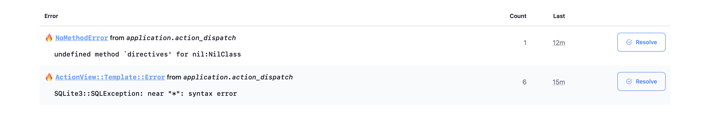
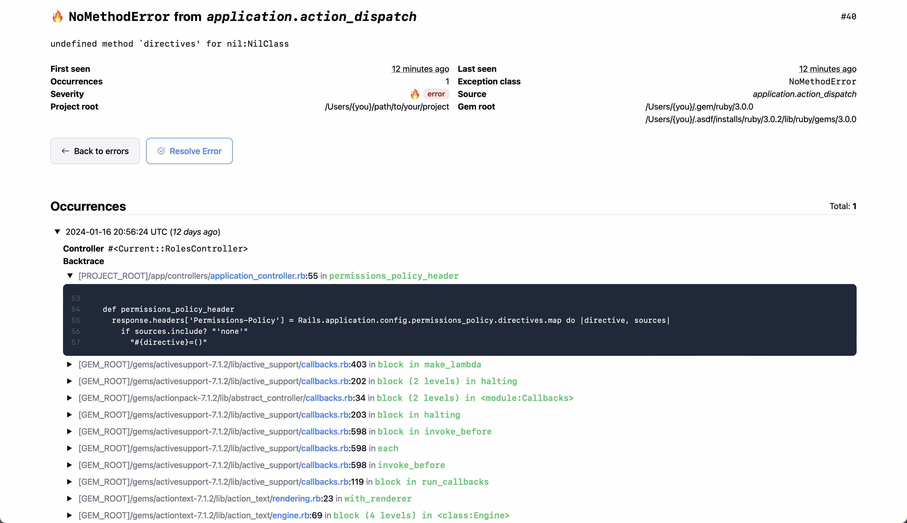

# Solid Errors

<p>
  <a href="https://rubygems.org/gems/solid_errors">
    
  </a>
  <a href="https://rubygems.org/gems/solid_errors">
    
  </a>
  <a href="https://github.com/testdouble/standard">
    
  </a>
  <a href="https://github.com/fractaledmind/solid_errors/actions/workflows/main.yml">
    
  </a>
  <a href="https://github.com/sponsors/fractaledmind">
    
  </a>
  <a href="https://ruby.social/@fractaledmind">
    
  </a>
  <a href="https://twitter.com/fractaledmind">
    
  </a>
</p>


Solid Errors is a DB-based, app-internal exception tracker for Rails applications, designed with simplicity and performance in mind. It uses the new [Rails error reporting API](https://guides.rubyonrails.org/error_reporting.html) to store uncaught exceptions in the database, and provides a simple UI for viewing and managing exceptions.

> [!WARNING]
> The current point release of Rails (7.1.3.2) has a bug which severely limits the utility of Solid Errors. Exceptions raised during a web request *are not* reported to Rails' error reporter. There is a fix in the `main` branch, but it has not been released in a new point release. As such, Solid Errors is **not** production-ready unless you are running Rails from the `main` branch or until a new point version is released and you upgrade.
> The original bug report can be found [here](https://github.com/rails/rails/issues/51002) and the pull request making the fix is [here](https://github.com/rails/rails/pull/51050). I will try to backport the fix into the gem directly, but I haven't quite figured it out yet.


## Installation

Install the gem and add to the application's Gemfile by executing:
```bash
$ bundle add solid_errors
```

If bundler is not being used to manage dependencies, install the gem by executing:
```bash
$ gem install solid_errors
```

After installing the gem, run the installer:
```bash
$ rails generate solid_errors:install
```

This will copy the required migration over to your app.

Then mount the engine in your `config/routes.rb` file:
```ruby
authenticate :user, -> (user) { user.admin? } do
  mount SolidErrors::Engine, at: "/solid_errors"
end
```

> [!NOTE]
> Be sure to [secure the dashboard](#authentication) in production.

## Usage

All exceptions are recorded automatically. No additional code required.

Please consult the [official guides](https://guides.rubyonrails.org/error_reporting.html) for an introduction to the error reporting API.

There are intentionally few features; you can view and resolve errors. That’s it. The goal is to provide a simple, lightweight, and performant solution for tracking exceptions in your Rails application. If you need more features, you should probably use a 3rd party service like [Honeybadger](https://www.honeybadger.io/), whose MIT-licensed [Ruby agent gem](https://github.com/honeybadger-io/honeybadger-ruby) provided a couple of critical pieces of code for this project.

### Configuration

You can configure Solid Errors via the Rails configuration object, under the `solid_errors` key. Currently, 6 configuration options are available:

* `connects_to` - The database configuration to use for the Solid Errors database. See [Database Configuration](#database-configuration) for more information.
* `username` - The username to use for HTTP authentication. See [Authentication](#authentication) for more information.
* `password` - The password to use for HTTP authentication. See [Authentication](#authentication) for more information.
* `sends_email` - Whether or not to send emails when an error occurs. See [Email notifications](#email-notifications) for more information.
* `email_from` - The email address to send a notification from. See [Email notifications](#email-notifications) for more information.
* `email_to` - The email address(es) to send a notification to. See [Email notifications](#email-notifications) for more information.

#### Database Configuration

`config.solid_errors.connects_to` takes a custom database configuration hash that will be used in the abstract `SolidErrors::Record` Active Record model. This is required to use a different database than the main app. For example:

```ruby
# Use a single separate DB for Solid Errors
config.solid_errors.connects_to = { database: { writing: :solid_errors, reading: :solid_errors } }
```

or

```ruby
# Use a separate primary/replica pair for Solid Errors
config.solid_errors.connects_to = { database: { writing: :solid_errors_primary, reading: :solid_errors_replica } }
```

#### Authentication

Solid Errors does not restrict access out of the box. You must secure the dashboard yourself. However, it does provide basic HTTP authentication that can be used with basic authentication or Devise. All you need to do is setup a username and password.

There are two ways to setup a username and password. First, you can use the `SOLIDERRORS_USERNAME` and `SOLIDERRORS_PASSWORD` environment variables:

```ruby
ENV["SOLIDERRORS_USERNAME"] = "frodo"
ENV["SOLIDERRORS_PASSWORD"] = "ikeptmysecrets"
```

Second, you can set the `SolidErrors.username` and `SolidErrors.password` variables in an initializer:

```ruby
# Set authentication credentials for Solid Errors
config.solid_errors.username = Rails.application.credentials.solid_errors.username
config.solid_errors.password = Rails.application.credentials.solid_errors.password
```

Either way, if you have set a username and password, Solid Errors will use basic HTTP authentication. If you have not set a username and password, Solid Errors will not require any authentication to view the dashboard.

If you use Devise for authentication in your app, you can also restrict access to the dashboard by using their `authenticate` constraint in your routes file:

```ruby
authenticate :user, -> (user) { user.admin? } do
  mount SolidErrors::Engine, at: "/solid_errors"
end
```

#### Email notifications

Solid Errors _can_ send email notifications whenever an error occurs, if your application has ActionMailer already properly setup to send emails. However, in order to activate this feature you must define the email address(es) to send the notifications to. Optionally, you can also define the email address to send the notifications from (useful if your email provider only allows emails to be sent from a predefined list of addresses) or simply turn off this feature altogether.

There are two ways to configure email notifications. First, you can use environment variables:

```ruby
ENV["SOLIDERRORS_SEND_EMAILS"] = true # defaults to false
ENV["SOLIDERRORS_EMAIL_FROM"] = "errors@myapp.com" # defaults to "solid_errors@noreply.com"
ENV["SOLIDERRORS_EMAIL_TO"] = "devs@myapp.com" # no default, must be set
ENV["SOLIDERRORS_ONE_EMAIL_PER_OCCURRENCE"] = false # defaults to false
```

Second, you can set the values via the configuration object:

```ruby
# Set authentication credentials for Solid Errors
config.solid_errors.send_emails = true
config.solid_errors.email_from = "errors@myapp.com"
config.solid_errors.email_to = "devs@myapp.com"
# Tell Solid Errors whether or not to limit the total emails per occurrence. Defaults to false.
config.solid_errors.one_email_per_occurrence = true
```

If you have set `send_emails` to `true` and have set an `email_to` address, Solid Errors will send an email notification whenever an error occurs. If you have not set `send_emails` to `true` or have not set an `email_to` address, Solid Errors will not send any email notifications.

If you have set `send_emails` to `true` and have set `one_email_per_occurrence` to `true`, Solid Errors will only send an email notification after the first occurrence of a new error or the first reoccurrence of a previously resolved error. If you have not set `one_email_per_occurrence` to `true`, Solid Errors will send an email notification for each occurrence of an error.

### Examples

There are only two screens in the dashboard.

* the index view of all unresolved errors:



* and the show view of a particular error:



### Usage with API-only Applications

If your Rails application is an API-only application (generated with the `rails new --api` command), you will need to add the following middleware to your `config/application.rb` file in order to use the dashboard UI provided by Solid Errors:

```ruby
# /config/application.rb
config.middleware.use ActionDispatch::Cookies
config.middleware.use ActionDispatch::Session::CookieStore
config.middleware.use ActionDispatch::Flash
```

### Overwriting the views

You can find the views in [`app/views`](https://github.com/fractaledmind/solid_errors/tree/main/app/views).

```bash
app/views/
├── layouts
│   └── solid_errors
│       ├── _style.html
│       └── application.html.erb
└── solid_errors
    ├── error_mailer
    │   ├── error_occurred.html.erb
    │   └── error_occurred.text.erb
    ├── errors
    │   ├── _actions.html.erb
    │   ├── _error.html.erb
    │   ├── _row.html.erb
    │   ├── index.html.erb
    │   └── show.html.erb
    └── occurrences
        ├── _collection.html.erb
        └── _occurrence.html.erb
```

You can always take control of the views by creating your own views and/or partials at these paths in your application. For example, if you wanted to overwrite the application layout, you could create a file at `app/views/layouts/solid_errors/application.html.erb`. If you wanted to remove the footer and the automatically disappearing flash messages, as one concrete example, you could define that file as:

```erb
<!DOCTYPE html>
<html>
  <head>
    <title>Solid Errors</title>
    <%= csrf_meta_tags %>
    <%= csp_meta_tag %>

    <%= render "layouts/solid_errors/style" %>
  </head>
  <body class="pb-4">
    <main class="container mx-auto mt-4">
      <%= content_for?(:content) ? yield(:content) : yield %>
    </main>

    <div class="fixed top-0 left-0 right-0 text-center py-2">
      <% if notice.present? %>
        <p class="py-2 px-3 bg-green-50 text-green-500 font-medium rounded-lg inline-block">
          <%= notice %>
        </p>
      <% end %>

      <% if alert.present? %>
        <p class="py-2 px-3 bg-red-50 text-red-500 font-medium rounded-lg inline-block">
          <%= alert %>
        </p>
      <% end %>
    </div>
  </body>
</html>
```

## Development

After checking out the repo, run `bin/setup` to install dependencies. Then, run `rake test` to run the tests. You can also run `bin/console` for an interactive prompt that will allow you to experiment.

To install this gem onto your local machine, run `bundle exec rake install`. To release a new version, update the version number in `version.rb`, and then run `bundle exec rake release`, which will create a git tag for the version, push git commits and the created tag, and push the `.gem` file to [rubygems.org](https://rubygems.org).

## Contributing

Bug reports and pull requests are welcome on GitHub at https://github.com/fractaledmind/solid_errors. This project is intended to be a safe, welcoming space for collaboration, and contributors are expected to adhere to the [code of conduct](https://github.com/fractaledmind/solid_errors/blob/main/CODE_OF_CONDUCT.md).

## License

The gem is available as open source under the terms of the [MIT License](https://opensource.org/licenses/MIT).

## Code of Conduct

Everyone interacting in the SolidErrors project's codebases, issue trackers, chat rooms and mailing lists is expected to follow the [code of conduct](https://github.com/fractaledmind/solid_errors/blob/main/CODE_OF_CONDUCT.md).
